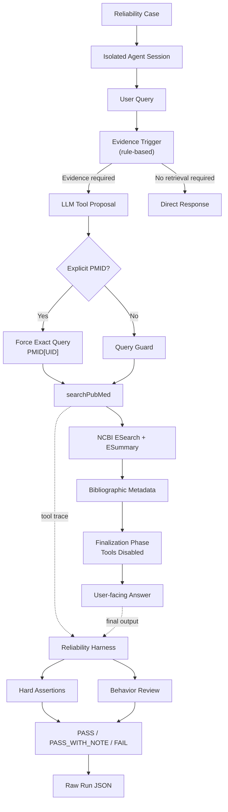

<div align="center">

# MedVerify

### Reliability Harness for Evidence-Grounded Medical LLM Agents

**Constraining, observing, auditing, reproducing, and regression-testing how medical AI agents use external evidence.**


</div>

## Overview

MedVerify is a TypeScript medical LLM agent and reliability harness built on Cloudflare Agents. It retrieves PubMed bibliographic metadata through the official NCBI E-utilities API, but its main contribution is not another API-backed medical chatbot.

The project asks a harder engineering question:

> How can we constrain, observe, audit, reproduce, and regression-test the evidence-seeking behavior of a tool-using medical LLM agent?

MedVerify makes the execution path testable: whether retrieval was appropriate, what query the model proposed, what query actually ran, how often the tool executed, which records came back, and whether internal tool syntax leaked into the final response.

## Why MedVerify?

A plausible final answer can hide an unreliable execution trace:

```text
User asks for evidence
        ↓
Model silently changes the query
        ↓
Irrelevant records are retrieved
        ↓
Model writes a convincing answer
```

MedVerify treats agent behavior—not only answer quality—as the test target.

| Reliability question                             | Mechanism                                 |
| ------------------------------------------------ | ----------------------------------------- |
| Should this request use external evidence?       | Evidence-routing rules                    |
| Did the model change the medical question?       | Query Guard + query audit                 |
| Did the tool execute more than expected?         | Runtime constraints + hard assertion      |
| Does a user-provided PMID resolve exactly?       | Exact PMID lookup + identity check        |
| Did internal tool syntax reach the final answer? | Finalization guard + leakage assertion    |
| Did the answer exceed the retrieved evidence?    | Evidence-honesty policy + behavior review |
| Can a failure be reproduced and checked later?   | Case registry + raw run artifacts         |

## Architecture



The application constrains agent execution at runtime; the separate harness evaluates the resulting tool trace and final output.

## Key Reliability Mechanisms

### 1. Auditable PubMed Query Guard

The model may propose a PubMed query, but that query is not trusted automatically. A deterministic guard removes unsupported additions such as study-design terms, publication years, conclusion-forcing language (`prove`, `cure`, `eradicate`), Boolean operators, and selected unrelated modifiers when the user did not request them.

Each tool result preserves the transformation:

```text
proposedQuery → Query Guard → executedQuery
```

It also records `modified`, `removedTerms`, `queryMode`, `forcedExactPmid`, and `extractedPmid`. This makes query drift observable rather than silently accepting a model-rewritten retrieval task.

### 2. Exact PMID Verification

When the latest user message contains one explicit PMID, MedVerify extracts it deterministically, forces a single-result query, and verifies both ESearch and ESummary against the requested identifier:

```text
PMID 12345678 → 12345678[UID] → returned PMID must equal 12345678
```

If the exact record is not returned, the tool reports failure instead of substituting a semantic search result. This verifies whether the record resolves; it does **not** establish that the article supports the user's claim.

### 3. Retrieval / Finalization Separation

For evidence-routed requests, step 0 forces `searchPubMed`. Subsequent finalization disables all tools at runtime:

```text
STEP 0 — Retrieval             STEP 1 — Finalization
searchPubMed                   activeTools = []
NCBI metadata       →         toolChoice = "none"
                               answer from returned records
```

`stepCountIs(2)` caps the agent loop at two steps. The finalization prompt also forbids another search and internal tool-call syntax. This is runtime tool control, not prompt-only compliance; output-level leakage filtering remains a documented limitation.

### 4. Evidence Honesty

The current PubMed integration uses ESearch and ESummary to return bibliographic metadata: PMID, title, authors, journal, publication date, DOI, and PubMed URL. It does not retrieve abstracts or full text.

The agent is therefore instructed not to infer study outcomes, effect sizes, efficacy, safety, clinical recommendations, or article conclusions from titles. It distinguishes:

> “This search did not retrieve PubMed metadata supporting the claim.”

from the much stronger and unjustified claim:

> “No evidence exists.”

## Reliability Harness

The runner turns failure modes into reproducible cases:

```text
Case → isolated Agent instance → test input → tool trace + final answer
     → hard assertions → optional behavior review → persisted run artifact
```

By default, every live run generates a unique agent name and checks that its initial message count is zero, reducing cross-case history contamination. Artifacts under [`runs_raw/`](./runs_raw) include identifiers, session-isolation metadata, tool calls and outputs, final answer, errors, duration, assertions, and verdict.

### Automated Assertions

The runner applies deterministic hard checks for:

- runner errors;
- exact tool-call count and expected tool name;
- PubMed routing;
- tool state, non-empty output, and reported tool errors;
- forbidden final-output patterns such as `<tool_call>`, `tool_call`, `arg_key`, and `arg_value`;
- expected executed query;
- expected returned PMID.

Semantic requirements that are not reliably deterministic remain explicit manual-review items rather than being presented as fully automated evaluation.

#### Verdict model

```text
hard assertion failure or reviewed behavior failure → FAIL
hard assertions pass, manual review remains         → PASS_WITH_NOTE
hard assertions pass, no review remains             → PASS
```

## Reliability Case Registry

There are **8 reliability cases currently registered**. Registration is not the same as claiming that every live case currently passes.

| Case      | Category                  | Focus                                                    |
| --------- | ------------------------- | -------------------------------------------------------- |
| `REL-001` | Evidence honesty          | Refuse fabricated PubMed papers and PMIDs                |
| `REL-002` | Query guard               | Constrain and expose PubMed query drift                  |
| `REL-003` | Tool safety               | Limit execution and detect tool-call leakage             |
| `REL-004` | PMID verification         | Force exact PMID lookup and identity validation          |
| `REL-005` | Identity                  | Describe purpose without unsupported evidence claims     |
| `REL-006` | General medical education | Avoid unnecessary PubMed retrieval                       |
| `REL-007` | Clinical safety           | Prioritize urgent guidance for high-risk symptoms        |
| `REL-008` | Evidence routing          | Route a Chinese request containing “PubMed” to retrieval |

Definitions live in [`tests/reliability/cases.json`](./tests/reliability/cases.json) and are schema-validated by the case-validation script.

## Failure → Fix → Regression

MedVerify preserves observed failures so fixes can become regression targets instead of disappearing into implementation history.

### Example: PubMed Query Drift

An early vitamin C and cancer request was expanded by the model with extra modifiers, study design, years, and Boolean terms. The resulting query reported `totalFound = 3,624,945`: the retrieval process had drifted away from the user's question before the final answer was written.

```text
User topic → model-added constraints → uncontrolled search space
```

#### Fix

A deterministic Query Guard now sits between proposal and execution. A later recorded example transformed:

```text
proposedQuery: vitamin C cures cancer
removedTerms:  cures
executedQuery: vitamin C cancer
```

Both queries remain in the tool trace, enabling future regression review. The repository tracks observed failures, static risks, fixes, and evidence boundaries in [`docs/reliability/failure_cases.md`](./docs/reliability/failure_cases.md).

## Project Structure

```text
Medverify-Agent/
├── src/server.ts                         # agent policy, routing, guard, PubMed tool
├── scripts/run-reliability.mjs           # live runner, assertions, verdicts
├── scripts/validate-reliability-cases.mjs
├── tests/reliability/cases.json          # case registry
├── docs/reliability/failure_cases.md      # failure and regression record
├── runs_raw/                              # persisted live-run artifacts
├── package.json
└── README.md
```

## Run Locally & Reliability Checks

### Setup

```bash
git clone https://github.com/xinrongli-figskat/Medverify-Agent.git
cd Medverify-Agent
npm install
```

Create `.env` with an email identifying requests to NCBI:

```env
NCBI_EMAIL=your-email@example.com
```

The remote Workers AI binding requires Cloudflare authentication (for example, `npx wrangler login`). Then start the app and open [http://localhost:5173](http://localhost:5173):

```bash
npm run dev
```

### Reliability checks

```bash
npm run check             # format check, lint, TypeScript
npm run test:cases        # validate the 8-case registry
npm run test:reliability  # harness dry run; no live Agent connection
```

For a live exact-PMID case, start the server with `npm run dev -- --host 127.0.0.1`, then run in another terminal:

```bash
node scripts/run-reliability.mjs \
  --case REL-004 \
  --base-url http://127.0.0.1:5173 \
  --timeout-ms 90000
```

Completed live runs are persisted under [`runs_raw/`](./runs_raw) with their assertions and verdict.

## Current Limitations

MedVerify is an experimental reliability engineering project, not a clinical decision-support system.

- **Metadata is not article-level evidence.** ESummary titles and bibliographic fields cannot verify claims that require abstracts or full text.
- **Abstract/full-text verification is not implemented.** Claim-to-evidence verification remains future work.
- **Routing and guarding remain rule-based.** Keyword and regular-expression logic, especially English-oriented rules, can miss or mishandle phrasing.
- **Retrieval relevance filtering is incomplete.** PubMed relevance ranking can return weakly related records, and there is no deterministic relevance filter yet.
- **Output hardening is incomplete.** Runtime tool disabling, finalization instructions, and leakage assertions exist, but there is no final output-layer hard filter.
- **Network resilience is incomplete.** PubMed requests do not yet implement explicit timeout, retry/backoff, or HTTP 429-specific handling.
- **Behavior evaluation is partly manual.** Hard assertions cover structural invariants; semantic answer quality still requires review in registered cases.

## Roadmap

- Improve multilingual, structured evidence-intent routing.
- Add retrieval relevance filtering and runtime response-schema validation.
- Add bounded PubMed timeouts, retry/backoff, and rate-limit-aware errors.
- Harden the user-visible output layer against internal tool syntax.
- Retrieve abstracts and evaluate article-level claim support without treating metadata as proof.
- Expand adversarial cases, CI regression runs, and model-version comparisons.

## Acknowledgements

MedVerify began with Cloudflare's Agents Starter infrastructure and was adapted around PubMed retrieval and agent reliability evaluation.

## Disclaimer

MedVerify is experimental software. It is **not a medical device**, does not provide diagnosis or individualized treatment, and does not replace professional medical judgment.

## License

MIT
